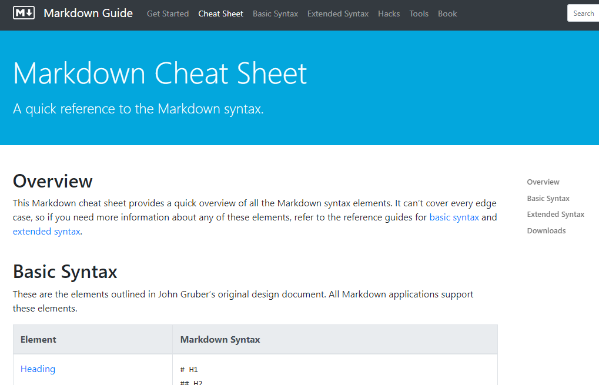

# aws-how-to

How to do basic shit on AWS

## Networking

1. Your computer has an IP address (1 IP address or 256 available IP addresses)
2. Router has a bunch of IP addresses (256)
   1. Table that defines where everything goes: Route Table
3. Everything in your house that connection to a router, gets an IP address
4. An IP is like an IP or a physical house address

255.255.255.0

192.168.4.1

Cover the first 3 numbers

XXX.XXX.XXX.1

Each numbers goes up to 256

SUBNET

Network = 192.168.4.1-256
192.168.4.1
192.168.4.2
192.168.4.3
192.168.4.4
...
192.168.4.256

Divide in half (My own private network of IPs, guest Wifi of IP)

Sub Network (Subnet)
A = Private network (1GB) - 128
192.168.4.0-127
RES 0, 1

B = Public network (1GB) - 64
192.168.4.128-192

C = IOT
192.168.4.193-255 - 64
RES 255

192.168.4.0-255
255.255.255.0

/24

256 = 8 bit number

192.168.4.124
[8 bit number].[8 bit number].[8 bit number].[8 bit number]

192           .    168       . 4            . 124

11111111      . 11111111     . 11111111     . 11111111

Base 10 = human math
235

BASE TEN

first place = 10 ** 0 = 1
second place = 10 ** 1 = 10
thiurd place = 10 ** 2 = 100

BASE TWO (Binary)

2 ** 0 = 1
2 ** 1 = 2
2 ** 2 = 4
2 ** 3 = 8
2 ** 4 = 16
2 ** 5 = 32
2 ** 6 = 64
2 ** 7 = 128
2 ** 8 = 256

12 = 1100

255.255.255.255 = /32

32 - 8 = 24, why 8? because 8 bits = 255

256 = /24

A /24 SUBNET GIVES YOU 255 IP ADDRESS AND TURNS THE LAST NUMBER TO 0 (NUMBER = OCTECT)

vpc = 10.0.0.0/16
255.255.0.0

Public  = 10.0.0.0/25 =  block of 128 address
Private = 10.0.0.128/25

CIDR 

## Resume

- Markdown
  - Learn more Markdown [here](https://www.markdownguide.org/cheat-sheet/).

- Github
  - Basic commands
    - First, clone the repo: `git clone https://github.com/jakefurlong/aws-how-to.git`.
    - Next, make changes to your files.
      - "DIFF" is a term used to describe the *difference* between 2 files.
    - Then, add the *changes* to a staging area: `git add README.md`.
    - Next, commit the changes: `git commit -m "Some kind of informational text"`.
    - Finally, push the staged changes to GitHub: `git push`.
  - Portfolio ideas
    - You can check our Github pages [here](https://pages.github.com/).